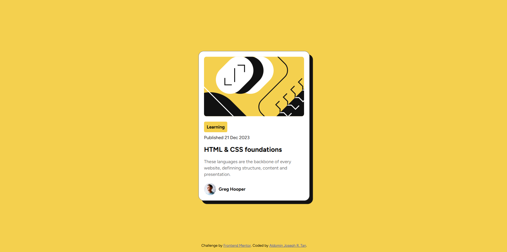
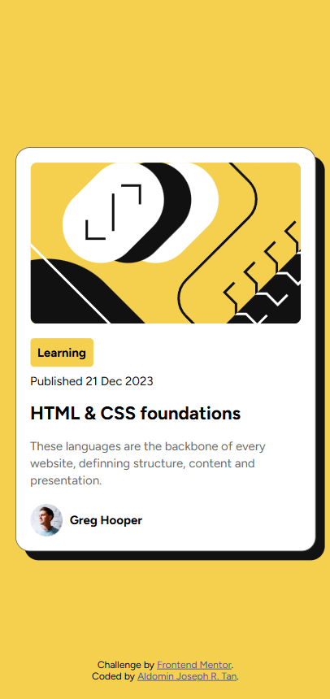

# Frontend Mentor - Blog preview card solution

This is a solution to the [Blog preview card challenge on Frontend Mentor](https://www.frontendmentor.io/challenges/blog-preview-card-ckPaj01IcS). Frontend Mentor challenges help you improve your coding skills by building realistic projects. 

## Table of contents

- [Overview](#overview)
  - [The challenge](#the-challenge)
  - [Screenshot](#screenshot)
  - [Links](#links)
- [My process](#my-process)
  - [Built with](#built-with)
  - [What I learned](#what-i-learned)
  - [Useful resources](#useful-resources)
- [Author](#author)

## Overview

### The challenge

Users should be able to:

- See hover and focus states for all interactive elements on the page

### Screenshot




### Links

- Solution URL: [https://github.com/AJ-Tan/2.-Frontend-Mentor---Blog-Preview-Card.git]
- Live Site URL: [https://aj-tan.github.io/2.-Frontend-Mentor---Blog-Preview-Card/]

## My process

### Built with

- Semantic HTML5 markup
- CSS custom properties
- Flexbox

### What I learned

By using the container features of css. I was able to make the font size dynamic by setting the parent container's font size with "cqw" as the unit of measurement. The font size adjusts with the size of the container (blog card).

```css
.blog__card {
  container-type: inline-size;
}

.blog__content {
  font-size: 4.5cqw;
}
```

### Useful resources

- [https://developer.mozilla.org/en-US/docs/Web/CSS/CSS_containment/Container_queries] - the documentation for the container feature.

## Author

- Github - [AJ-Tan](https://github.com/AJ-Tan)
- Frontend Mentor - [@AJ-Tan](https://www.frontendmentor.io/profile/AJ-Tan)